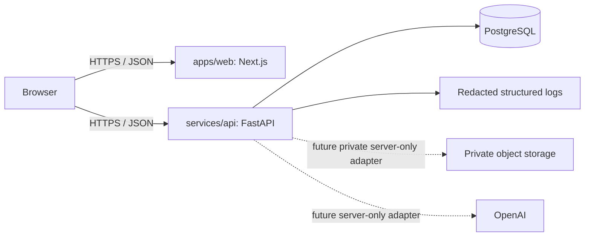

# CVMatcher Architecture

## Phase 1 implementation

CVMatcher is a modular monorepo with a Next.js frontend and a FastAPI backend. The services are independently buildable, but Phase 1 remains a single product architecture rather than a microservice system.

## Repository layout

| Path | Responsibility |
|---|---|
| `apps/web` | TypeScript-strict Next.js App Router frontend, Tailwind tokens, typed API client, browser tests. |
| `services/api` | FastAPI application, Pydantic settings/schemas, SQLAlchemy models, Alembic migrations, API and security tests. |
| `packages/contracts` | Versioned product-contract documentation for future analysis results. |
| `docs/adr` | Architecture decisions. |
| `infra` / `compose.yaml` | Development infrastructure and container definitions. |

## Trust boundaries

The browser is untrusted. The API derives ownership from a future server-side principal instead of client body fields. PostgreSQL is accessed through a typed engine/session abstraction. Raw CV content, uploads, parsers, and OpenAI are deliberately excluded from Phase 1 and must enter through dedicated server-only adapters in later phases.

## Database foundation

Phase 1 migrates `users` as the ownership anchor and `audit_events` for non-content security metadata. All future user-owned records must include a non-null user ownership reference and use service-level ownership checks. No CV, job description, extracted document text, score, or AI output is persisted yet.

## Deployment boundary

The web and API services each have a container definition. Development PostgreSQL is provided through Compose. Production provider choices for identity, private object storage, managed PostgreSQL, secrets, and observability are deliberately external configuration decisions; no provider credentials are encoded in this repository.
