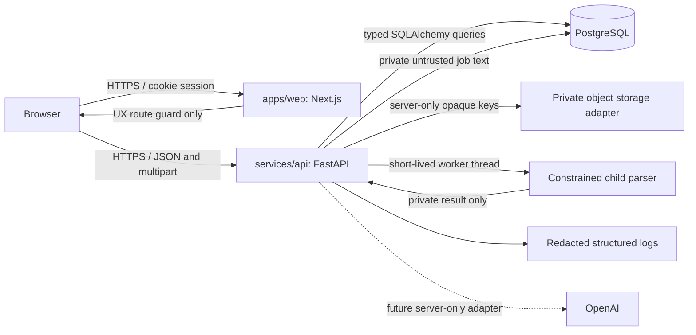

# CVMatcher Architecture

## Implemented Phase 4 architecture

CVMatcher is a modular monorepo with a Next.js frontend and a FastAPI backend. The services are independently buildable, but the product remains a deliberately simple single-application architecture: one browser client, one API, one PostgreSQL database, and one private-storage adapter boundary. It does not use microservices, queues, Redis, vector storage, billing infrastructure, or AI orchestration.

## Repository layout

| Path | Responsibility |
|---|---|
| `apps/web` | TypeScript-strict Next.js App Router frontend, Tailwind tokens, cookie-aware typed API client, accessible account and CV intake experiences, browser tests. |
| `services/api` | FastAPI application, Pydantic settings/schemas, SQLAlchemy models, Alembic migrations, ownership-scoped API services, and API/security integration tests. |
| `packages/contracts` | Versioned product-contract documentation for future deterministic analysis results. |
| `docs/adr` | Recorded architecture and security decisions. |
| `compose.yaml` | Development PostgreSQL configuration. |

## Identity and session boundary

The browser submits credentials only to the API. The API hashes passwords with Argon2 and persists only `password_credentials.password_hash`; plaintext credentials are neither persisted nor logged. Local identity remains attached to the existing `users` ownership anchor through a server-generated `local:<uuid>` subject.

A successful registration or login issues a high-entropy opaque session cookie. PostgreSQL stores an HMAC digest of that token, its expiration, revocation timestamp, and hashed request metadata. Browser JavaScript cannot read the session cookie. A readable CSRF cookie is paired with an `X-CSRF-Token` header and a server-side token digest for state-changing authenticated routes.

The Next.js `proxy.ts` provides a browser-level route guard for `/app`, but it is intentionally not the authorization authority. Every protected FastAPI route resolves the session on the server and derives the principal from the validated session.

## Document, extraction, and target-role boundary

Phase 2 persists document bytes and safe metadata. Phase 3 adds only explicit private text extraction for one already-owned immutable version. Phase 4 adds explicit private target-role and pasted job-description intake. It does **not** render documents, parse job requirements, run OCR, extract skills, perform matching, send content to OpenAI, or serve document downloads.

| Layer | Implemented responsibility |
|---|---|
| Browser | Selects a PDF or DOCX, reports byte-upload progress, and presents typed recoverable errors. |
| API route | Requires a server-derived session and valid CSRF token. It never accepts client-provided ownership IDs. |
| Intake adapter | Streams uploads into private staging files, enforces a 10 MiB file limit, normalizes filenames, verifies extension/declaration/signature agreement, and validates DOCX container markers without extracting content. |
| Private storage | Uses a local development/test adapter with restrictive staging/object permissions and server-generated opaque keys. It exposes no public URL or download route. |
| Extraction service | Resolves ownership by document and signed-in principal, reads one stored object server-side, then invokes a short-lived spawned child process from a worker thread. The parent enforces an 8-second deadline and terminates overdue workers. |
| Parser worker | On Linux, applies 4-second CPU and 256 MiB address-space limits. It uses `pypdf` for PDFs, standard ZIP/XML parsing for DOCX, a 100-page PDF ceiling, shared DOCX archive validation, DTD/entity rejection, and a 250,000-character output ceiling. It returns primitive status data only. |
| Target-role route | Requires the server-derived session and CSRF validation for creation. It validates title, optional context fields, and bounded pasted job-description text; ownership is never client supplied. |
| PostgreSQL | Stores user-owned logical documents, immutable versions, one extraction record per version, and user-owned target roles. `cv_extractions.extracted_text` and `job_targets.job_description` are server-only; public projections expose safe metadata only. |

## Database model

| Table | Role |
|---|---|
| `users` | Canonical user ownership anchor. |
| `password_credentials` | One local Argon2 credential hash per user. |
| `user_sessions` | Revocable opaque session and CSRF token digests with expiration. |
| `cv_documents` | Logical user-owned CV record. |
| `cv_document_versions` | Immutable uploaded version metadata and opaque object key. |
| `cv_extractions` | One private extraction lifecycle record per immutable version, with constrained source type/status values, count, server-only text, safe failure message, and timestamps. |
| `job_targets` | User-owned target-role metadata and private untrusted pasted job description with a stored character count. |
| `audit_events` | Existing non-content security-event metadata foundation. |

All document, extraction, and target-role queries derive ownership from the authenticated user. Target-role lists filter by that principal and public summaries omit the pasted description. An absent, unowned, or not-yet-created extraction returns the same `404` response, so resource existence is not disclosed across tenants. A unique database constraint and version-row lock make extraction creation idempotent for a single immutable version.

## Deployment boundary

The web and API services each have a container definition. Development PostgreSQL is provided through Compose. CI provisions PostgreSQL, applies Alembic migrations, and runs database-backed integration tests. The local filesystem storage adapter is accepted only for development/test; production configuration rejects it and must receive a managed private object-storage implementation before document intake is enabled.

Production still requires HTTPS termination, a managed PostgreSQL service, production secret management, a private object-storage adapter, operational monitoring, and backup/retention decisions. These provider credentials and decisions are not encoded in this repository.
