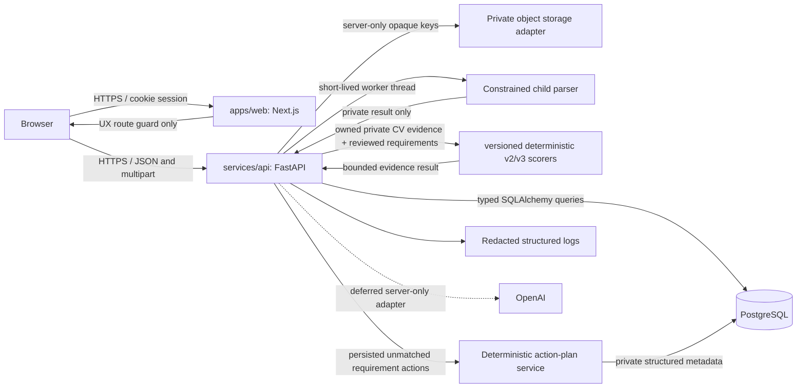

# CVMatcher Architecture

## Implemented backend architecture through deterministic scoring v3

CVMatcher is a modular monorepo with a Next.js frontend and a FastAPI backend. The services are independently buildable, but the product remains a deliberately simple single-application architecture: one browser client, one API, one PostgreSQL database, and one private-storage adapter boundary. It does not use microservices, queues, Redis, vector storage, billing infrastructure, AI orchestration, or external scoring services.

## Repository layout

| Path | Responsibility |
|---|---|
| `apps/web` | TypeScript-strict Next.js App Router frontend, Tailwind tokens, cookie-aware typed API client, accessible account/CV/target/analysis experiences, and browser tests. |
| `services/api` | FastAPI application, Pydantic settings/schemas, SQLAlchemy models, Alembic migrations, ownership-scoped services, deterministic scorer, and API/security integration tests. |
| `packages/contracts` | Documented public analysis request/result contract. |
| `docs/adr` | Recorded architecture and security decisions. |
| `compose.yaml` | Development PostgreSQL configuration. |

## Identity and session boundary

The browser submits credentials only to the API. The API hashes passwords with Argon2 and persists only `password_credentials.password_hash`; plaintext credentials are neither persisted nor logged. Local identity remains attached to the existing `users` ownership anchor through a server-generated `local:<uuid>` subject.

A successful registration or login issues a high-entropy opaque session cookie. PostgreSQL stores an HMAC digest of that token, its expiration, revocation timestamp, and hashed request metadata. Browser JavaScript cannot read the session cookie. A readable CSRF cookie is paired with an `X-CSRF-Token` header and a server-side token digest for state-changing authenticated routes.

The Next.js `proxy.ts` provides a browser-level route guard for `/app`, but it is intentionally not the authorization authority. Every protected FastAPI route resolves the session on the server and derives the principal from the validated session.

## Operational reliability boundaries

| Boundary | Implemented behavior | Explicit limit |
|---|---|---|
| Deployment settings | Staging and production reject development-prefixed session secrets and non-HTTPS CORS origins. Production also rejects local filesystem storage and a local rate-limit backend. | A production shared limiter factory and managed storage adapter are not supplied by this repository. |
| Database resources | The async engine uses pre-ping plus validated pool/overflow/wait bounds and asyncpg statement/idle-transaction server timeouts. | Capacity, failover, backups, and operational tuning require managed-database decisions. |
| Rate limiting | General, authentication, and expensive-request policies emit standard budget/retry headers and fail closed on unavailable configured backends. Allowed browser origins can read those headers. | The bundled backend is process-local; no distributed provider or trusted-proxy policy is activated. |
| Request observability | JSON logs include correlation IDs and a bounded completion event with method, route template, status, and duration. | No raw request target, query, document content, identity/resource ID, or external telemetry provider is logged or configured. |
| Migration integrity | CI upgrades the database and runs `alembic check` to detect ORM metadata drift without a matching migration. | It does not replace production migration reviews, backups, or restore drills. |

## Private document, target, and analysis boundary

Phase 2 persists private document bytes and safe metadata. Phase 3 adds explicit private text extraction for one already-owned immutable version. Phase 4 adds explicit private target-role and pasted job-description intake. Phase 5 adds an explicit comparison of exactly one prepared owned CV version and one owned target role.

| Layer | Implemented responsibility |
|---|---|
| Browser | Uploads PDFs/DOCX files, reports private preparation status, saves target-role metadata, selects one prepared CV and one target, and renders only bounded evidence results. |
| API route | Requires a server-derived session for all private reads and a valid CSRF token for all creates. It never accepts a client-provided owner ID. |
| Intake and storage | Streams a maximum 10 MiB PDF/DOCX into private storage with safe metadata and opaque keys. No public storage URL or document-download route exists. |
| Extraction service | Owner-scopes an immutable version and runs bounded parsing in a short-lived spawned child process. Raw extracted text remains in `cv_extractions.extracted_text`. |
| Target-role service | Owner-scopes a strict target form and stores raw pasted job text only in `job_targets.job_description`. Public target projections expose safe metadata and a character count. |
| Requirement service | Owner-scopes manual structured requirements under one target role, constrains category/priority/review state, and returns only bounded reviewed metadata through cursor pagination. |
| Match-analysis service | Owner-scopes both selected resources, requires an analysis-eligible extraction, preserves v2 reuse, and derives v3 results only from server-owned reviewed requirements plus normalized CV evidence. V3 reuse is keyed by a server-computed input fingerprint. |
| Deterministic scorer | Treats CV/job text as untrusted data. It uses no network call, model, embedding, prompt, or semantic inference; only exact normalized text, fixed source-controlled vocabularies, and fixed component weights are used. |
| Action-plan service | Reads one owned persisted v3 analysis, derives unmatched-requirement actions with fixed category/priority rules, and permits only bounded owner-managed status changes. |
| Audit-event service | Records fixed allowlisted authentication, extraction, analysis, and action lifecycle categories with scalar metadata and request correlation only. It has no public read API and never records document content. |
| PostgreSQL | Stores user-owned documents, immutable versions, extractions, target roles, structured requirements, derived analyses, action snapshots, and private audit metadata. Raw source text never leaves server-controlled data paths. |

## Deterministic analysis flow

1. The browser loads safe CV metadata, extraction status, and safe target metadata.
2. The user selects a CV version whose existing extraction status is `succeeded` and a saved target role.
3. `POST /api/v1/match-analyses` validates CSRF and resolves the session principal.
4. `MatchAnalysisService` queries the selected CV version through its owning `cv_documents.user_id`, locks that version row, owner-scopes the target, and checks for an existing result at the current scoring version.
5. The service rejects unavailable extraction text with `409 CV_TEXT_NOT_READY`; inaccessible resource references remain uniform `404 RESOURCE_NOT_FOUND` responses.
6. `deterministic-v2` builds five transparent components: skills, explicit years evidence, controlled keyword evidence, degree-category evidence, and structural ATS signals. A non-applicable component contributes neutral `100` without changing weights.
7. The private derived result is persisted in `match_analyses.result_payload`; the response exposes only version, score, components, gaps, and timestamp.
8. The workspace focuses the result and explains the method without displaying CV text, job-description text, source IDs, or a hiring prediction.

## Database model

| Table | Role |
|---|---|
| `users` | Canonical user ownership anchor. |
| `password_credentials` | One local Argon2 credential hash per user. |
| `user_sessions` | Revocable opaque session and CSRF token digests with expiration. |
| `cv_documents` | Logical user-owned CV record. |
| `cv_document_versions` | Immutable uploaded version metadata and opaque object key. |
| `cv_extractions` | One private extraction lifecycle record per immutable version, with server-only text and safe lifecycle metadata. |
| `job_targets` | User-owned target-role metadata and private untrusted pasted job description with a stored character count. |
| `job_requirements` | User-owned manual structured requirements with category, normalized skill, priority, review state, normalization version, and safe source reference. |
| `match_analyses` | Owner-owned derived score/result for one CV version, target role, scoring version, and input fingerprint. The fingerprint makes v3 requirement mutations explicitly versioned without changing historical results. |
| `analysis_actions` | Owner-owned action snapshots derived from unmatched v3 requirement evidence. They cascade from analyses and retain an optional current requirement reference. |
| `audit_events` | Private allowlisted authentication, extraction, analysis, and action lifecycle metadata with optional owner and request-correlation references. |

All document, extraction, target, analysis, and action queries derive ownership from the authenticated user. Public analysis/action responses omit raw CV text, raw job-description text, raw requirement text, storage keys, and internal parser/scorer implementation state. The CV-version row lock and tuple constraint preserve idempotent result creation for a selected immutable version and scoring version; the analysis-action lock and unique analysis/requirement pair preserve action-generation idempotency.

## Deployment boundary

The web and API services each have a container definition. Development PostgreSQL is provided through Compose. CI provisions PostgreSQL, applies Alembic migrations, checks ORM/migration drift with `alembic check`, and runs database-backed integration tests. The local filesystem storage adapter is accepted only for development/test; production configuration rejects it and must receive a managed private object-storage implementation before document intake is enabled.

Production still requires HTTPS termination, a managed PostgreSQL service, production secret management, a private object-storage adapter, a shared rate-limit provider with a trusted-proxy policy, operational monitoring, backup/retention decisions, recovery/restore controls, and user-controlled data lifecycle operations. These provider credentials and decisions are not encoded in this repository.
