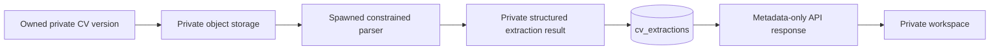

# Secure Extraction Refinement Implementation Report

**Status:** Complete and locally verified
**Date:** 2026-08-26
**Scope:** An additive refinement of the existing Phase 3 private PDF/DOCX extraction foundation. This work adds bounded parser/quality metadata and safety regression coverage; it does not add OCR, AI, matching changes, queues, external services, or public document access.

## Architecture

CVMatcher retains a single private extraction path: a user-owned immutable CV version is owner-scoped and row-locked, read only through the server-side opaque storage key, then parsed in a spawned child process. The worker accepts bytes and declared stored content type only; it has no application database session, no storage credentials, no network client, and no callback path that can execute extracted content. The parent persists private raw text only after a bounded result returns.

The structured result remains internal: source type, private text, parser version, safe quality classification, and bounded warning codes. The public response exposes only parser version, quality, warning codes, status, type, character count, completion time, and safe failure message. It never returns raw document bytes or extracted text.

## Libraries and parser approach

| Format | Implementation | Rationale |
|---|---|---|
| PDF | `pypdf` over in-memory bytes in the constrained child process | The repository already depends on this focused text-based parser; no OCR, external service, or new dependency is needed. |
| DOCX | Python standard-library `zipfile` and `xml.etree.ElementTree` over `word/document.xml` only | Avoids a broad document-processing dependency and disables macro/external content execution by never executing Office content or following relationships. |
| Process isolation | Python `multiprocessing` with the `spawn` method | The parser is separated from API/database/storage objects and can be terminated by the parent. |

## Implemented controls and limits

| Control | Enforced behavior |
|---|---|
| Ownership | API derives the authenticated owner server-side; inaccessible versions and extraction records receive uniform `404` responses. |
| Document validation | Upload checks filename normalization, declared MIME, signature agreement, and a DOCX Office container before storage. |
| Resource bounds | 10 MiB upload/read bound; 8-second parent wall-clock deadline; Linux child `RLIMIT_CPU=4s`; `RLIMIT_AS=256 MiB`; 100 PDF page maximum; 250,000 extracted-character maximum. |
| DOCX bomb protections | Maximum 2,000 ZIP entries and 50 MiB aggregate uncompressed content; required Office markers; absolute and parent-traversal ZIP entries rejected. |
| XML safety | Only `word/document.xml` is read; `DOCTYPE` and `ENTITY` markers are rejected before XML parsing. |
| Macro/external safety | No macros, embedded executables, images, relationships, or external URLs are executed, downloaded, or resolved. |
| Temporary files | Upload staging uses a private `0700` directory and `0600` files; failure and discard paths unlink temporary files deterministically. |
| Failure recovery | Parser/storage errors return a generic user-safe failure; no raw content, file path, worker exception, or internal metadata is exposed. |
| Quality metadata | `bounded-text-v2`, `quality`, and bounded warning codes are stored with an extraction. `NO_EXTRACTABLE_TEXT` is surfaced as a safe workspace warning without showing any CV text. |

## Files changed

| Path | Purpose |
|---|---|
| `services/api/alembic/versions/20260826_0006_extraction_metadata.py` | Additive migration for parser version, quality, and warning metadata. |
| `services/api/app/models/cv_extraction.py` | Persist safe extraction metadata alongside server-only raw text. |
| `services/api/app/services/cv_extraction.py` | Add pure bounded quality assessment and persist metadata after child-process parsing. |
| `services/api/app/schemas/extraction.py` | Add public metadata-only fields. |
| `services/api/app/api/extraction.py` | Serialize only approved metadata. |
| `services/api/app/tests/test_extraction.py` | Cover quality assessment and metadata-only API delivery. |
| `services/api/app/tests/test_migrations.py` | Require the new migration columns. |
| `apps/web/lib/api-client.ts` | Type the additive extraction metadata contract. |
| `apps/web/components/app/CvExtractionControl.tsx` | Present the safe no-readable-text warning. |
| `apps/web/tests/cv-workspace.test.tsx` | Cover the safe warning state. |

## Verification

| Check | Result |
|---|---|
| Development migration | `20260826_0006 (head)` |
| Backend lint and strict typecheck | Passed |
| Backend full regression suite | `52 passed`; one pre-existing Starlette/httpx deprecation warning |
| Frontend lint/typecheck | Passed |
| Frontend test suite | `11 passed` |
| Production web build | Passed |
| Dependency checks | `pnpm audit --audit-level high` and `pip3 check` passed |
| Repository hygiene | `git diff --check` passed |

## Known limitations

The system remains text extraction only. It cannot interpret rasterized/scanned CVs, text encoded as images, or unsupported Office/PDF constructs; it warns when no text can be read rather than claiming the document is blank. OCR is deliberately deferred because it would add a new high-risk parser/data-processing surface. PDF parsing is resource-bounded but not a malware scanner or full sandbox; production still requires a least-privilege runtime/container review and a managed private object-storage adapter. Raw extracted text remains private and is not exportable under the current approval-gated privacy strategy.

## Next non-destructive phase

The next safe product phase should improve the deterministic extracted-document quality layer only: add further bounded, non-content quality signals and user guidance for unsupported/scanned documents, while maintaining private text boundaries. OCR, AI, OpenAI, matching/scoring expansion, and all approval-gated lifecycle infrastructure remain out of scope.
