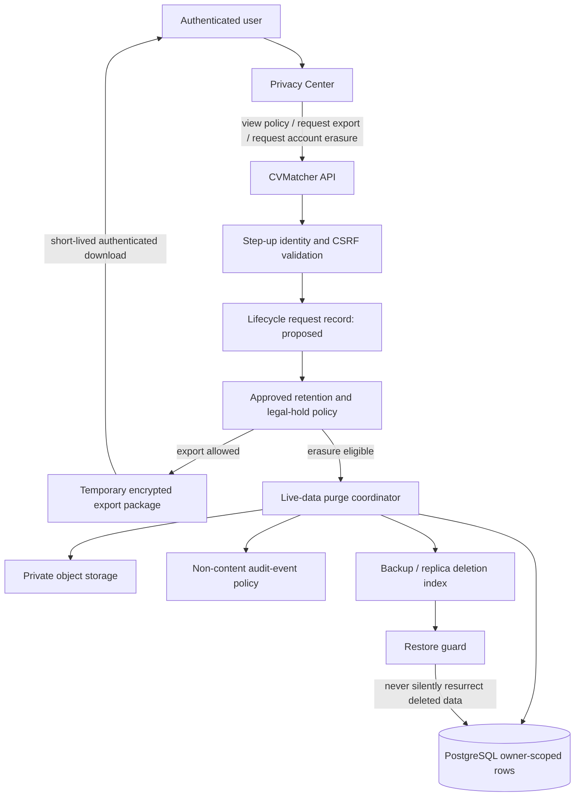
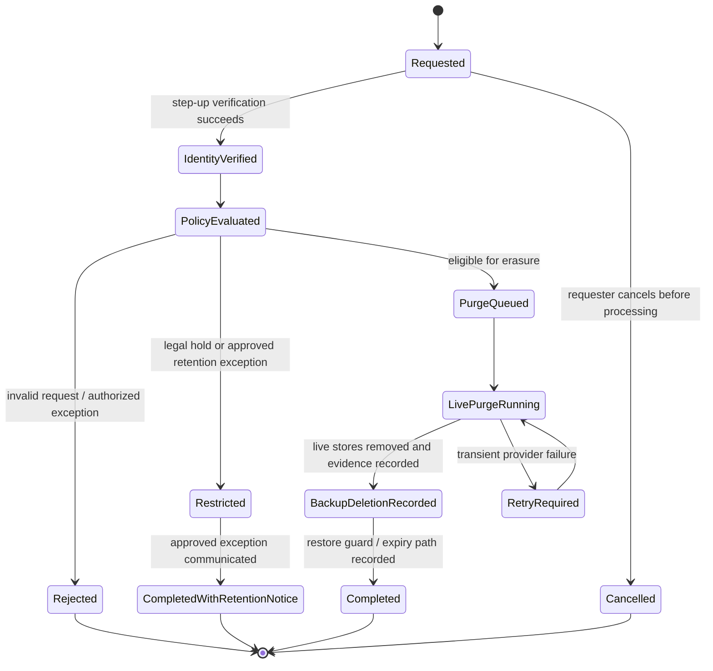

# CVMatcher Production Privacy and Data-Lifecycle Strategy

**Status:** Design proposal; no irreversible production lifecycle infrastructure is approved or implemented by this document.
**Date:** 2026-08-26
**Scope:** CVMatcher as implemented through Phase 6. “CVWatcher” in the approval request is treated as CVMatcher.

> This is an engineering and product strategy, **not legal advice**. Retention periods, legal bases, jurisdictional applicability, subprocessors, and legal-hold rules require approval from the responsible business and legal stakeholders before production activation.

## 1. Executive decision

CVMatcher already has a strong private-data baseline: server-derived owner scoping, opaque sessions, CSRF protection, private object keys, bounded extraction, raw-source-text exclusions from API/UI responses, deterministic local scoring, and document/target deletion flows. However, it does **not** yet have the production capabilities needed to represent a complete privacy lifecycle: a user-facing Privacy Center, account-level deletion, export generation, retention policies, legal holds, managed-storage erasure evidence, backup inventory, restoration safeguards, or an auditable data-subject-request workflow.

The recommended approach is **policy-driven hard deletion from live systems, with narrowly scoped tombstone/audit metadata retained only when approved and necessary**. A generic soft-delete flag is not an acceptable substitute for erasure. It leaves sensitive data in the operational data plane, complicates access control, risks accidental reactivation, and does not resolve backup or export obligations. The existing Phase 6 per-resource deletes remain valid as immediate live-system deletion actions; they must not be misrepresented as account-level erasure or backup purge.

The strategy introduces no queue, Redis, vector database, microservice, AI provider, or other infrastructure by default. A reliable asynchronous job runner may become justified only after an approved account-deletion/export workflow needs managed retries, immutable request records, and a backup-aware purge schedule.

## 2. Current data inventory

The table reflects the actual Phase 1–6 models and storage boundary. It distinguishes raw sensitive content from derived data and metadata so that every deletion/export request can be located deterministically.

| Asset / store | Current data | Classification | Current lifecycle | Target production treatment |
|---|---|---|---|---|
| `users` | Email, local auth subject, timestamps | Personal identifier | Created at registration; no account deletion lifecycle | Account root; delete or de-identify only through approved account-erasure workflow. |
| `password_credentials` | Argon2 password hash, timestamps | Authentication secret material | Cascades when user is deleted | Never export; hard-delete with account. |
| `user_sessions` | HMAC session/CSRF digests, expiry/revocation, hashed user-agent/IP metadata | Security metadata / pseudonymous identifiers | Revoked on logout; cascades on user deletion | Short operational retention set by approved configuration; purge expired/revoked rows automatically. |
| `cv_documents` | Owner link, safe title, timestamps | Personal metadata | Phase 6 owner delete | Hard-delete from live DB with versions/extractions/analyses. |
| `cv_document_versions` | Filename, type, size, digest, opaque private object key | Personal metadata / protected storage reference | Cascades with document deletion | Hard-delete from DB after production object delete is confirmed or permanently retriable. |
| Private object storage | Uploaded PDF/DOCX bytes | Highly sensitive personal data | Local development adapter immediately deletes opaque object keys | Managed private object store with encryption, version/replication policy, deletion marker/purge evidence, and backup mapping. |
| `cv_extractions` | Raw extracted CV text, parser metadata/status | Highly sensitive personal data | Cascades with version deletion | Hard-delete with version; never surface raw text in logs/export unless expressly approved in an authenticated export. |
| `job_targets` | Role metadata and raw job description | Personal/user-provided confidential content | Phase 6 owner delete | Hard-delete with target; no public copies. |
| `match_analyses` | Versioned deterministic scores, bounded evidence, gaps | Derived personal/career data | Cascades when linked CV version or target is deleted | Direct analysis deletion should be added; hard-delete with source deletion; export only after policy approval. |
| `audit_events` | Event type, optional user ID, request ID, non-content JSON metadata, timestamp | Security/accountability metadata | User FK becomes `NULL` on user deletion | Separate approved retention schedule; no CV/job text; pseudonymize unlinkable identifiers on account erasure where possible. |
| API/application logs | Correlation and redacted operational metadata | Operational metadata; may become personal if misconfigured | No formal lifecycle in repository | Centralized redaction, restricted access, documented retention, and no raw source content. |
| Backups / replicas / exports | Not implemented or provider-defined in the repository | Same class as source data | No lifecycle defined | Inventory, encryption, retention, restore controls, and erasure-aware process required before launch. |

## 3. Current and proposed lifecycle architecture



The first part of this diagram—owner-scoped deletion from the live database and local private storage—exists today. Everything labelled **proposed** requires approved policy and production design. A production restore process must consume a deletion index or equivalent before making restored data live, so restoring an old backup cannot silently resurrect data that was erased from production.

## 4. Privacy Center UX

The Privacy Center should be a protected `/app/privacy` experience, not a marketing page. It must use clear language, visible status, keyboard-accessible controls, and one-time confirmations for destructive operations.

| Area | User-facing behavior | Server-side requirement |
|---|---|---|
| Data overview | Show categories held, purpose, current policy version, and plain-language retention criteria—not raw private document text. | Read only approved public policy configuration and safe account counts/statuses. |
| CV, target, and analysis controls | Link to existing per-resource delete controls; explain dependent deletion before confirmation. | Owner-scoped reads; CSRF-protected delete; idempotent safe failures; audit metadata only. |
| Download my data | Explain included categories, excluded secrets/security data, package format, expiry, and one-time access. | Step-up authentication, request rate limit, immutable request record, encrypted temporary package, short signed download tied to user/session. |
| Delete account | Show all live categories that will be removed, legal-hold/retention exceptions, cancellation point if approved, and final state. | Step-up authentication plus current password or an equivalent approved factor; policy/hold evaluation; account-erasure state machine. |
| Privacy requests | Status timeline: submitted, identity verified, pending policy review, processing, completed, partially completed, rejected with reason. | Strong authorization, append-only non-content request metadata, staff workflow only if approved. |
| Policy transparency | Show policy version, last review date, contact path, data processors/transfer information when applicable. | Policy configuration published from reviewed source—not arbitrary business text. |

The European Commission and EDPB emphasize clear information, accessible rights exercises, data-flow awareness, request tracking, and response processes; data portability is intended to use a structured, commonly used, machine-readable format.[1] [2] CVMatcher should use JSON for structured records and retain an explicit product decision on whether original uploaded documents are included in an export.

## 5. Deletion state machine

Per-resource Phase 6 deletion is an immediate live-data action. The production account-erasure workflow must instead be durable and stateful.



**Rules:**

1. No state may expose raw CV, job-description, or extraction content in audit logs.
2. `Requested` is not a deletion. Data remains accessible until the approved workflow reaches the live purge step, unless a restriction flag is legally/policy required.
3. A retry preserves the same request ID and is safe to execute repeatedly.
4. `Completed` means live systems are purged and backup/restore handling is recorded according to the approved provider policy; it must not claim physical erasure from immutable backup media before the provider process supports that claim.
5. `CompletedWithRetentionNotice` requires a policy/legal reason, data minimization, restricted processing, and user communication. The right to erasure is not absolute; applicable exceptions must be evaluated by the responsible policy owners.[1] [2]

## 6. Retention-policy configuration model

CVMatcher must not hardcode legal retention periods. The following is a **configuration shape**, not a recommended duration. Each duration and exception must be approved, versioned, justified by purpose/legal basis, and reviewed.

```yaml
policy_version: "YYYY-MM-approved-revision"
review_due_at: "approval-required"
jurisdiction_scope: "approval-required"
records:
  uploaded_cv_object:
    purpose: "User-requested CV storage and comparison"
    active_account_rule: "approval-required"
    after_resource_delete_rule: "purge live object; record backup disposition"
    after_account_erasure_rule: "approval-required"
  extracted_cv_text:
    purpose: "User-requested deterministic comparison"
    active_account_rule: "approval-required"
    after_resource_delete_rule: "hard-delete with source version"
  job_description:
    purpose: "User-requested target-role comparison"
    active_account_rule: "approval-required"
    after_resource_delete_rule: "hard-delete with target"
  deterministic_analysis:
    purpose: "User-requested comparison result"
    active_account_rule: "approval-required"
    after_source_delete_rule: "hard-delete by foreign-key cascade"
  session_metadata:
    purpose: "Session security and abuse response"
    active_account_rule: "approval-required"
    purge_rule: "expired/revoked operational records"
  audit_metadata:
    purpose: "Security accountability and incident investigation"
    active_account_rule: "approval-required"
    erase_rule: "minimize; unlink user identifier when account is erased unless approved exception applies"
  backup_copies:
    purpose: "Disaster recovery"
    retention_window: "provider-and-policy approval required"
    restore_guard: "mandatory before restoring data to a live environment"
```

Configuration must be read only at runtime, validated strictly, stored outside source control when values are sensitive, and accompanied by a human-readable policy snapshot. The ICO notes that retention schedules should identify record type, purpose, and intended retention, while the exact duration needs to be justified rather than assumed.[3]

## 7. Hard deletion and soft deletion boundaries

| Situation | Required approach | Why |
|---|---|---|
| User deletes one CV, target, or analysis | **Hard-delete live data** after authorization and confirmation. | These are user-managed content records with no approved business reason for operational retention. |
| Account erasure request | **Stateful purge request, then hard-delete live account data** once identity, policy, and exceptions are evaluated. | A bare `deleted_at` flag is inadequate for high-sensitivity CV content. |
| Pending legal hold or approved exception | **Restricted processing**, not generic soft delete. | Data can be retained only for a documented purpose, with processing limited and access restricted. |
| Security audit events | **Metadata-only retention or anonymization**, never document text. | Accountability may require a limited event trail; unlinked metadata should be preferred. |
| Backups/immutable snapshots | **Delete per approved provider process; prevent live resurrection before expiry.** | Backups need a documented restoration and expiry mechanism; offline data still remains personal data. |
| Temporary export package | **Encrypted, time-bounded hard purge** after one-time download or expiry. | Exports replicate sensitive data and should never become a second data store. |

Soft deletion may be used only for a narrow, approved operational delay such as a cancellable account-erasure request. It must deny normal product access, suppress processing, have a fixed policy-bound terminal action, and never be used to retain raw CV or job text indefinitely. It is not a compliance claim by itself.

## 8. Database and object-storage deletion strategy

### Database

The existing database already cascades `users -> credentials/sessions/documents`, `documents -> versions -> extractions`, and source resources -> `match_analyses`. Account deletion must first inventory every table with a direct or indirect user link, including nullable audit-event references. Purge code should use owner-scoped transactions, locks where race prevention matters, idempotent states, and explicit foreign-key coverage tests. It must neither log raw source values nor accept client-provided object keys.

A future `privacy_requests` table may be appropriate after policy approval because it is non-destructive and supports explicit request state. It should store only user linkage, request type, state, policy version, timestamps, operator/action metadata, and opaque job/error codes. It must not store exported data, CV text, job text, credentials, or legal-reason prose that becomes a secondary sensitive store.

### Object storage

The production adapter must preserve the existing opaque-key interface while adding provider-backed encryption, private access, object version/replica inventory, idempotent delete semantics, delete-result evidence, and a restricted administrative restore path. Lifecycle/versioning settings must be reconciled with erasure promises before launch: object versioning or replication can retain prior bytes after a delete marker. No bucket policy, encryption model, replication configuration, or provider choice is approved by this design.

## 9. Backup, recovery, and restore implications

Backups are not exempt from privacy strategy. A production decision must specify database point-in-time recovery, object-storage replication/versioning, export archives, monitoring/telemetry copies, retention window, encryption, access control, and a restoration procedure. The design must record when a live deletion becomes eligible to age out of each backup class, without inventing a duration.

A restore guard is mandatory. Before a recovered database/object snapshot reaches a live environment, it must reconcile a deletion index or equivalent approved source of truth and reapply completed erasures. The control must be tested in an isolated recovery environment. Restoring production data into development or a shared test environment is prohibited unless the data is irreversibly anonymized under an approved process.

The ICO emphasizes that deletion should put data beyond use and that backup copies must be addressed rather than treated as an invisible exception.[3] This strategy therefore separates **live-system deletion evidence** from **backup-expiry/restore-guard evidence** and never promises instantaneous destruction of all historic backup media unless the provider architecture can demonstrate it.

## 10. Data export strategy

A future export is a privacy feature and a sensitive-distribution feature. The minimum safe design is:

| Decision | Proposed safe default | Requires approval? |
|---|---|---:|
| Request authentication | Current session + step-up reauthentication | No for design; yes for authentication factor choice |
| Format | Versioned JSON manifest with documented schema | No |
| Original CV files | Exclude until policy explicitly approves inclusion | Yes |
| Raw extracted CV/job text | Exclude by default | Yes |
| Deterministic analysis | Include safe result projections after policy approval | Yes |
| Security/session digests | Exclude | No |
| Audit events | Include only an approved, redacted subject-access projection | Yes |
| Package encryption | Encrypt at rest; one-time authenticated download; purge on expiry | No for principle; yes for provider details and expiry value |
| Direct transfer to another controller | Not in MVP | Yes |

The EDPB describes portability as structured, commonly used, machine-readable data, while noting that it applies only in certain circumstances; the product should not make legal applicability claims in UI copy.[1]

## 11. Security and authorization requirements

1. All privacy actions require the existing server-derived principal and CSRF validation; destructive account-level actions additionally require approved step-up identity verification.
2. Use uniform non-disclosing failures for resource ownership. Privacy-request status should be visible only to the requester and explicitly authorized staff workflow, if any.
3. Rate-limit export/account-erasure initiation and download attempts separately from general traffic. Do not alter current limiter architecture without a dedicated scale decision.
4. Treat exports as highly sensitive: encryption, short access window, single-use token or session-bound delivery, no CDN/public URL, access event metadata, and guaranteed expiry purge.
5. Audit only non-content metadata: action type, request ID, policy version, state transition, actor class, timestamp, and outcome code. Never retain CV/job/extraction/analysis raw content in audit payloads.
6. Enforce data minimization in telemetry, error tracking, support tooling, test fixtures, and backups. New third-party processors require a separate approval, contract, transfer, and consent analysis.
7. Add adversarial tests for CSRF, IDOR, stale session, duplicate request, cancellation, retry after partial provider failure, backup-restore guard, and export-token replay before activation.

## 12. Implementation plan

| Phase | Safe deliverable | Approval gate |
|---|---|---|
| A. Policy registry | Versioned, read-only policy schema and Privacy Center content model; no durations hardcoded. | Policy owner approves values before production use. |
| B. Privacy Center read-only | Data inventory, policy version, existing resource-management links, and clear limitations. | Safe to implement after UX copy review; no destructive infrastructure. |
| C. Export request workflow | Request records, step-up verification, rate limits, redacted manifest design, temporary package controls. | Requires export scope, delivery, retention, and provider approval. |
| D. Account deletion workflow | State machine, legal-hold/restriction behavior, cancellation rules, job/retry design, user notices. | Requires retention, legal exceptions, backup/restore, and support-process approval. |
| E. Managed storage and backup controls | Provider adapter, encryption, replica/versioning configuration, lifecycle/erasure evidence, restore guard and drills. | Requires provider/security/operations approval. |
| F. Production activation | End-to-end deletion/export tests, incident runbook, privacy notice, staff procedures, monitoring, periodic review. | Requires legal, security, operations, and business sign-off. |

## 13. Decisions requiring approval

| Decision | Why approval is mandatory |
|---|---|
| Controller identity, jurisdictions, legal basis, and privacy-notice text | Legal and business policy, not an engineering inference. |
| Retention durations for every record class | No single duration is valid by default; purpose and applicable requirements determine it.[3] |
| Account-erasure cancellation window and legal-hold workflow | Defines when data remains available and when irreversible processing begins. |
| Backup/PITR/object-version/replica retention and erasure method | Determines whether erasure can be fulfilled and how restore avoids resurrection. |
| Production storage provider, encryption/KMS, regional residency, and subprocessors | Security, procurement, data-transfer, and contractual decisions. |
| Whether original CVs, raw extracted text, raw job descriptions, analyses, and audit projections appear in exports | Directly changes the sensitive-data exposure surface. |
| Step-up verification factor and support escalation process | Affects account takeover and fraudulent deletion risk. |
| Audit-event retention, user unlinking, and incident/legal-claim exceptions | Requires an accountability-versus-minimization policy choice. |
| Staff roles, approval boundaries, and operational runbooks | Elevated access and deletion authority require explicit governance. |

## 14. Explicit non-goals

This design does not implement AI, OpenAI integration, model prompts, embeddings, exports, account deletion, legal holds, production object storage, backup systems, destructive migrations, or irreversible deletion infrastructure. It preserves Phase 6 without reworking it.

## References

[1]: https://www.edpb.europa.eu/sme/be-compliant/respect-individuals-rights_en "European Data Protection Board — Respect individuals’ rights"
[2]: https://commission.europa.eu/law/law-topic/data-protection/information-individuals_en "European Commission — Information for individuals"
[3]: https://ico.org.uk/for-organisations/uk-gdpr-guidance-and-resources/data-protection-principles/a-guide-to-the-data-protection-principles/storage-limitation/ "ICO — Storage limitation"
